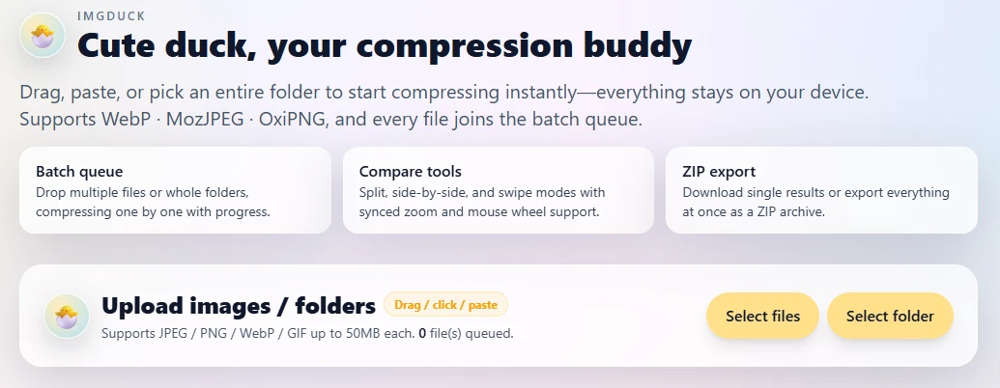

# Imgduck

Imgduck is a cute, fully client-side image compression playground built with React + TypeScript + Vite. Drag files, paste from the clipboard, or upload whole folders to build a batch queue, compare quality in full screen, and download results individually or as a ZIP—all without leaving your browser.



- [中文說明 (Traditional Chinese)](README.zh-TW.md)

- Demo: https://adalf0722.github.io/imgduck/

## Highlights

- **Local-only compression** – Every operation runs inside the browser for maximum privacy.
- **Flexible inputs** – Drag-and-drop, click-to-upload, clipboard paste, and folder selection feed the batch queue.
- **Batch workflow** – Each item shows status, saved size, and has one-click or ZIP download options.
- **Visual comparison** – Split, side-by-side, and swipe modes with synced zoom/pan give instant feedback.
- **Friendly UI** – Floating pastel panels keep the image full screen while controls stay within reach.
- **Multiple formats** – WebP, MozJPEG, and OxiPNG with quality and max-dimension controls.

## Tech Stack

| Category | Tools |
| --- | --- |
| Framework | React 18, TypeScript 5 |
| Build | Vite 5 |
| Styling | Tailwind CSS + custom pastel theme |
| Image processing | browser-image-compression, Canvas API, JSZip |

## Project Structure

```
src/
├── components/       # ImageUploader, ImagePreview, BatchList, CompressionSettings, etc.
├── hooks/            # useBatchCompression, useFileDrop, useImageCompression
├── utils/            # compression helpers, file utilities
├── types/            # shared TypeScript types
├── main.tsx          # entry point
└── index.css         # pastel theme styles
```

## Development

```bash
npm install       # install dependencies
npm run dev       # start dev server (http://localhost:5173)
npm run lint      # lint the codebase
npm run build     # generate production build
```

## Notes for Contributors

- `src/hooks/useBatchCompression.ts` controls the queue, validation, compression flow, and ZIP export—extend here for advanced logic like workers or custom presets.
- `src/components/ImagePreview.tsx` manages comparison modes, zoom/pan, and swipe gestures; adjust it when enhancing the viewing experience.
- `src/components/BatchList.tsx` renders queue progress and downloads; ideal for features such as sorting, grouping, or filtering.
- The duck logo lives in `.duck-logo`; swap in `public/dock.webp` / `dock.png` or other SVGs/emoji as needed.

## License

This project is provided for demonstration purposes—adapt, deploy, and remix it for your own team or personal workflow.***
