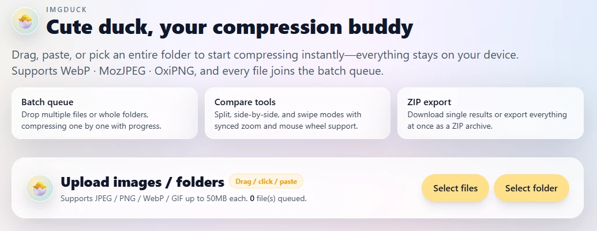

# Imgduck

Imgduck is a fully client-side image compression playground built with React + TypeScript + Vite. Drag files, paste from the clipboard, or upload whole folders to build a batch queue, compare quality in full screen, and download results individually or as a ZIP, all in your browser.



Languages: [English](README.md) | [Traditional Chinese](README.zh-TW.md)

> [!NOTE]
> Demo: https://adalf0722.github.io/imgduck/

## Highlights

- **Local-only compression** -- Every operation runs inside the browser for maximum privacy.
- **Flexible inputs** -- Drag-and-drop, click-to-upload, clipboard paste, and folder selection feed the batch queue.
- **Batch workflow** -- Each item shows status, saved size, and has one-click or ZIP download options; download buttons stay prominent and show compressed size.
- **Visual comparison** -- Split, side-by-side, and swipe modes with synced zoom/pan; the preview lightbox supports prev/next (buttons + arrow keys).
- **Crop tools** -- Fixed-ratio cropping for the active image with apply/reset support.
- **Friendly UI** -- Compression settings open by default on desktop (still hideable); floating pastel panels keep the image full screen while controls stay within reach.
- **Multiple formats** -- MozJPEG (default), WebP, and OxiPNG with quality and max-dimension controls.

## Tech Stack

| Category | Tools |
| --- | --- |
| Framework | React 18, TypeScript 5 |
| Build | Vite 7 |
| Styling | Tailwind CSS + custom pastel theme |
| Image processing | browser-image-compression, Canvas API, JSZip |

## Project Structure

```
src/
├── components/       # ImageUploader, ImagePreview, BatchList, CompressionSettings, etc.
├── hooks/            # useBatchCompression, useFileDrop, useImageCompression
├── utils/            # compression helpers, file utilities
├── types/            # shared TypeScript types
├── main.tsx          # entry point
└── index.css         # theme styles
```

## Development

```bash
npm install       # install dependencies
npm run dev       # start dev server (http://localhost:5173)
npm run lint      # lint the codebase
npm run build     # production build
```

## JPEG Batch Script (Python)

You can also run offline batch JPEG compression with:

```bash
python scripts/jpeg_batch_compress.py <target_path>
```

- If `target_path` is a directory: recursively scans all subdirectories (excluding the root itself).
- If `target_path` is a single image file: treats its parent directory as one processing unit and uses that file as the first gate image.

Options:

```bash
--quality 80        # JPEG quality (default: 80)
--threshold 50      # first-image saving threshold in percent (default: 50)
--restart           # rebuild TODO/progress file and start over
--retry-failed      # retry directories marked as failed in progress
```

Progress file:

- Stored at: `<target_root>/.jpeg_batch_progress.json`
- Supports resume after interruption (done items are skipped by default).

Examples:

```bash
# Process all subdirectories under D:\photos
python scripts/jpeg_batch_compress.py D:\photos

# Process a single file's parent directory, using this file as gate-first
python scripts/jpeg_batch_compress.py D:\photos\set1\cover.jpg

# Resume and retry failed directories
python scripts/jpeg_batch_compress.py D:\photos --retry-failed

# Start over from scratch
python scripts/jpeg_batch_compress.py D:\photos --restart
```

## Notes for Contributors

- `src/hooks/useBatchCompression.ts` controls the queue, validation, compression flow, and ZIP export.
- `src/components/ImagePreview.tsx` manages comparison modes, zoom/pan, and swipe gestures.
- `src/components/BatchList.tsx` renders queue progress and downloads.
- `src/utils/cropImage.ts` contains the fixed-ratio crop helper used by the crop modal.
- The duck logo uses the `.duck-logo` class; swap in assets under `public/` or emoji as needed.

## License

MIT
